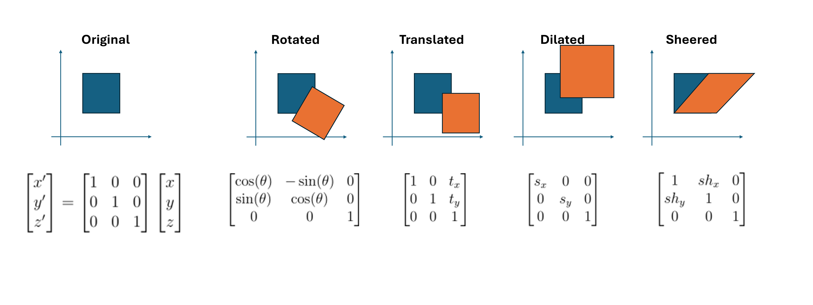

# COMPSCI 180 Project 3 Writeup

## Introduction
Transformations are powerful mathematical tools that allow us to transfigure photos into specific structures with specified disentanglements of its "structural details" and "texture". Particularly, the popular morphing technique applied onto pairs of pictures, can transform the subject of one image into the subject of another in an almostly seamless manner. And, we can also direct the methods of transformation onto faces, where we elicit the particular structural details and texture-ic properties of faces of specific demographics, in turn extrapolating faces towards different demographics or features via linear algebraic manipulations. In this assignment post, we detail all the techniques described above via the tasks prescribed by [the assignment per se](https://inst.eecs.berkeley.edu/~cs180/fa24/hw/proj3/index.html).

## Preliminaries
### Affine Transformations
Considering the viewpoint that all images are fundamentally some tensor, the shifting of one pixel into another location can be naturally considered as a matrix multiplication.
Paritcularly, the transformations that may occur via a matrix multiplications are parametrized by its operator.
A survey of such transformation has been delivered in many lower-division courses, and so will be summarized with the following picture:

All of these transformations are either linear, in that it serves as a change of basis while obeying linearity (the composition of homoegeneity and superposition properties), or are affine. Fundamentally, affine transformations occur by matrix multiplications and additions, in a linear algebraic sense.
They also have the following properties (migrated from the lecture slide):
- The origin does not necessarily map to origin, due to a possible translation.
- Parallel lines remian parallel
- The transformation is closed under composition
- The transformation models a change of basis.

Using homogeneous coordinates, which is an augmented coordinate system for any-dimensional coordinates such that $(x_1, \dots, x_n, w) = (x_1 / w, \dots, x_n / w)$, we may unify the description of affine transformations as one single matrix operation:

$$
\begin{bmatrix} x' \\ y' \\ w \end{bmatrix} =
\begin{bmatrix}
    a & b & c \\
    d & e & f \\
    0 & 0 & 1 \\
\end{bmatrix}
\begin{bmatrix}
    x \\ y \\ w
\end{bmatrix}
$$

Particularly, each degree of freedom from the aforementioned parametrization in $a, b, \dots, f$, comes from the possible candidate components of any affine transformations: translation, scaling, rotation, and sheering.
Please see [this slidework, slide #27](https://inst.eecs.berkeley.edu/~cs180/fa23/Lectures/warping.pdf) for an in-depth description.

### Warpping
Notably, any triangle can be transformed into any other triangle via an affine transformation.
For the pacing of this post, let us directly assume we will be transforming triangles into triangles. The fundemental reason of this will be described in the next section, when we discuss morphing.

#### Finding $\mathcal{T}$
How many "correpondences", or points on the triangle that definitely correpond to each other, do we need?
Since each triangle has three vertices, there are six coordinates (at least) involved in each transformation. Therefore, for three vertices of the triangle $V = \{V_n = (x_n, y_n) | n \in \{1, 2, 3\}\}$ and its transformed version $V'$, we find the following system of equations that will enable us to infer the parameters of affine transformation that occurred:

$$
\begin{bmatrix}
    x_1 & y_1 & 0 & 0 & 1 & 0 \\
    0 & 0 & x_1 & y_1 & 0 & 1 \\
    x_2 & y_2 & 0 & 0 & 1 & 0 \\
    0 & 0 & x_2 & y_2 & 0 & 1 \\
    x_3 & y_3 & 0 & 0 & 1 & 0 \\
    0 & 0 & x_3 & y_3 & 0 & 1
\end{bmatrix}
\begin{bmatrix}
    \hat{a} \\ \hat{b} \\ \hat{d} \\ \hat{e} \\ \hat{c} \\ \hat{f}
\end{bmatrix}
=
\begin{bmatrix}
    x_1' \\ y_1' \\ x_2' \\ y_2' \\ x_3' \\ y_3'
\end{bmatrix}
$$

You can arrange the above equation to make the parameter list alphabetically sorted.
So, based on the vertices of a transformed triangle, we can infer its transformation operator $\mathcal{T}$.

#### Forward vs. Inverse Warpping
There are two general patterns for warpping: forward-warpping and inverse-warpping.

In forward warpping, once we infer the operator $\mathcal{T}$, we map the value of each pixel at position $(x, y)$ to its transformed equivalent $\mathcal{T}((x, y))$, and non-integer pixel coordinates will have its values distributed among neighboring pixels. However, this pattern of warpping easily leads to "holes" in the resulting product, where certain pixels do not receive any coloration.

Therefore, our assignment proceeds with an alternative method: inverse warpping. In this paradigm, we infer an operator $\mathcal{T}$ from the source image to a target image, and use the inverse operator: $\mathcal{T}^{-1}$ to do pixel mapping as described above. However, since the source image's pixel values are all known, we can safely interpolate the unknown pixel values with its neighbors. An efficient manner of doing so is bi-linear interpolation, where for each $(x_t, y_t) = \mathcal{T}^{-1}(x, y)$ resulted, its coloring is inferred as a weighted sum of its neighbor.
In our assignment, we apply a variation of this logic that will be described below (out of the unclarity of the original assignment's instruction, we devise a variation of this interpolation function fitting our context).

### Morphing
#### Cross-Dissolving
Cross-dissolving is a technique that allows us to interpolate the pixels of intersecting, supposedly-"merged" images via linear interpolation (a weighted sum). Particularly, in this method we define a halfway image with a parametrization of $t \in [0, 1]$:

$$
(1 - t) \times {image}_1 + t \times {image}_2
$$

One conspicuous drawback of this technique is that this only works on aligned images.

#### Triangulation for Structure
An efficient method to dictate the structure of objects in an image is via defining a triangular gridmap over important landmarks of the object. For example, the picture of one face of a diamond can be defined as several triangles, allowing us to construct a structural map for the prism-ful diamond face. An example of triangular mesh may be seen when we discuss the operational details of this assignment.

In this assignment, we employ the Delaunay triangulation method. In the naive rendition of this triangulation method, we may start with an arbitrary triangulation of our image, and we flip any illegal edge within the triangulation until no more illegal edges exist. Here, an illegal edge refers to an edge that would improve the triangulation by being flipped. A good triangulation is one where the triangles are less narrow. The precise technicalities of these approaches are (somewhat) out of scope for this blog post. Then, the clever rendition of Delaynay triangulation is by solving a dual of the triangulation problem via the use of Voronoi diagrams.

#### Morphing Sequence
The morphing sequence is defined as a sequence of warpped image over some schedule of $w(t)$ where $t \in [0, 1]$. Particularly, the $k^{th}$ image of a warpping sequence is constructed as:
1. Decide the warp fraction at timestep $k$, and decide the midway shape of faces as $(1-t) {image}_1 + (t) {image}_2$.
2. Warp both faces into this shape.
3. Cross dissolve them at the dissolve fraction at timestep $k$.

This schedule of dissolve and warp fractions can be freely decided as a monotonously increasing function with values starting from $0$ and ending at $1$.

In this assignment, we export such sequence of image as an animated GIF and output it to this website for grading purposes.

### Faces
Now, let us discuss your face. My face. As well as many people's faces.
Our faces are interesting.
Particularly, our faces can be defined with several landmark features.
The Danes dataset of this assignment, for instance, defines 58 landmarks to each of its subject's face.

Faces can be warpped, morphed into each other via the aforementioned strategies. Interestingly, we can also use the above viewpoints to define populational mean shapes and textures of faces for specific demographics, allowing us to define the "male prototypical" and "female prototypical" face based on the dataset labeling. BASED ON THE DATASET LABELING.
1. Find the mean shape of one subpopulation's faces
2. Warp all faces of that subpopulation into their mean shape, then blend all of them with eqaul weight to obtain the pixel values of a prototypical face.

Upon doing so, we can get the supposed deviation that distinguishes male and female prototypical faces by the following procedure:
1. Warp the male and female prototypical faces into a halfway shape between them. Let's call the results "prototypical warps".
2. Obtain the "pixelated deviation" of these subpopulations by subtracting the female prototypical warp's pixel values with the male prototypical warp's pixel values.

Of course, to simply create a caricature, one can also just subtract the population mean from one's own picture.
This works similarly to an unsharpened mask filter, where the edge component is reinforced by subtracting away the mean of the image at a larger weight.
In the sense of creating a caricature, we simply create an image where "our" components are largely reinforced by subtracting away the population face average.

**Now, let us head into the assignments.**

## Defining Correspondences
Correspondences are defined via an online tool from last year's student, publicized on the instructional website of this assignment.
I am summarizing the overall process of picture processing as well as their resulting triangulations via the following image:

<!-- The image should contain two patterns of triangulation, while also showing the triangulation overlay -->

Particularly, correspondence points are chosen and selected in specific orders to secure the similarity of triangulations between warpping processes.
As mentioned before, this plays a significant role in the successful, undistorted results, and prevents us from morphing our face into abstract art.
Particularly, targeting essential structures of faces and preventing collinear triplets of points helps to prevent the deformation of triangular meshes.

I was walked into when I took my photo at my lab's rotation seat, if you wanted a fun story somewhere in this blog :')

## Computing the Mid-way Face
As mentioned in the methodologies section, computing a midway face involves a three-step procedure:
1. Computing the average face shape by averaging the correspondence points together-- this is why the ordering in correspondence points matters.
2. Warpping both faces into the average face shape described above, which we perform inverse warpping for.
3. Average the warpped faces' pixel values (colors) together.

Particularly, we fill in parts of the faces by constructing polygon masks.
This is where a tricky point occurs.
If we simply apply our affine transformation on the noted coordinates of polygon masks from original faces onto the midway face, we will find several stripes throughout the mask, which occurs due to integer coordiantes not being covered.
This is also a known weakness of forward warpping.
Therefore, we adapt an alternative algorithm for warpping, where:
1. First, let us compute the polygon mask of the warpped triangles, not the original faces'
2. Then, for each integer coordinate within the polygon, we first obtain a possibly floating-point-involving coordinate that corresponds to a location in the original face's triangle.
3. For that triangle, we perform bilinear interpolation to obtain the supposed value of that pixel.

Here, bilinear interpolation involves only the original face, whose pixel values are not to be changed. Therefore, this operation can be vectorized via array arithmetics, and occurs fairly efficiently.

The resulting mid-way face is as follows:

## "It's Morphin' Time": The Morph Sequence
The scheduling for the following morphing sequence is specifically tuned to be non-linear such that the morphing aspect of the trajectory is more clearly visualized. This agenda is applied to both the wrap fraction and the dissolve fraction at the same time. The precise methodology should be referred to at the beginning of this post, in the preliminaries section.

Now, let's look at the morphing sequence GIF:

If the GIF is not running, it's most likely just a markdown problem. Check [Here](https://github.com/Bransthre/bransthre.github.io/tree/master/post_assets/cs180/proj3) instead.

Here is a table of all frames involved:

Bill (Zheng) has suggested that I put "Can you feel my heart" onto the GIF.
I did that for my friend's instead, [he](https://ryanliu30.github.io/projects/cs180-project3/) liked the joke (I think).

## The "Mean Face" of A Population
There will be a bit more implementational details written here (because I recently suffer from not seeing any in papers I need to adopt).

### The Danes dataset
I'm pretty sure the dataset is not called "Danes", but it is as linked [here](https://web.archive.org/web/20210305094647/http://www2.imm.dtu.dk/~aam/datasets/datasets.html).
Particularly, we use the dataset with 200+ faces and obtain it from a 2007 capture of webarchive. Talk about finicky.

The Danes dataset has filenames in the format of `<person-id>-<category><biological-sex>.jpg` as well as an `.asf` file of the same signature.
Here, the `.jpg` files are `640x480` image files of faces aligned to the center of each image, while the `.asf` are point coordinate recording files.
For more details, reference their report.
In our use case, we designed a parser for `.asf` files using RegEx. Talk about finicky.

Here are the average geometries for each categories of photos:

Here are some examples of them warpped into the average geometry of their own categories:

Here are the average faces, which you can morph into:

A gallery of morphing GIFs may be reviewed below, where prototypical faces are morphed into one image of the group:

If the GIF is not running, it's most likely just a markdown problem. Check [Here](https://github.com/Bransthre/bransthre.github.io/tree/master/post_assets/cs180/proj3) instead.

And finally, I warpped my face into the average geometries (as well as having average faces morph into my geometry):

The pictures above have already experienced a lot of translations for aligning the facial pictures along the dataset's assets. ***Talk about finicky :melting_face:.***

## Caricatures: Extrapolating From The Mean
To produce a caricature, simply apply the method we mentioned at the methodology section, computing the following expression:

$$
{\rm my~face} \times (1 - \alpha) + {\rm average~face} \times \alpha
$$

Here, a value of $\alpha < 0$ allows us to extrapolate from the population mean and reinforce our features.
On the other hand, a value of $\alpha > 1$ performs its opposite, reinforcing the average face's feature.
Below, I provide a table of caricatures across diverse values of $\alpha$ and subpopulations involved in the dataset.

## Bells and Whistles: Manipulating the Prototypical Information of Face
In this seciton, we directly apply the gender manipulating method mentioned in our methodolgoy section near the beginning of the post. In the following gender-wise caricature, you can see the male prototype reinforced at the left image, and female prototype reinforced at the right image. Some features, like lighter eyebrows and heavier beards, are conspicuous.
Below are some results:

Now I'm suddenly glad I am the way I am (perhaps until I go back and deal with my project).

## Conclusion
Roses are red, the assignment is now done. \
Now that the blog post is written and I learned a lot about the power of simple linear operations I am impressed and I think I can be gone.

Roses are red, my wandb alerts are booming. \
Thank you for reading and grading and now I need to go deal with unsupervised reinforcement learning.
